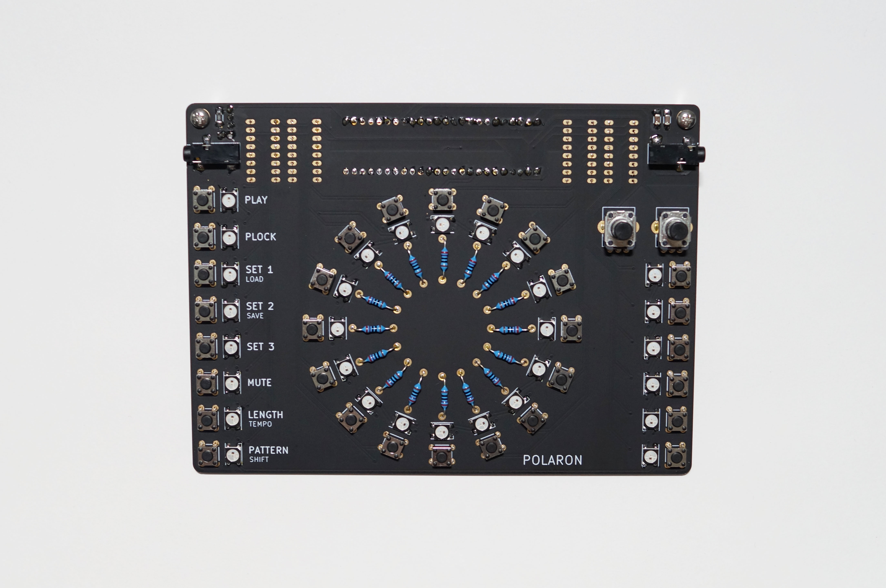
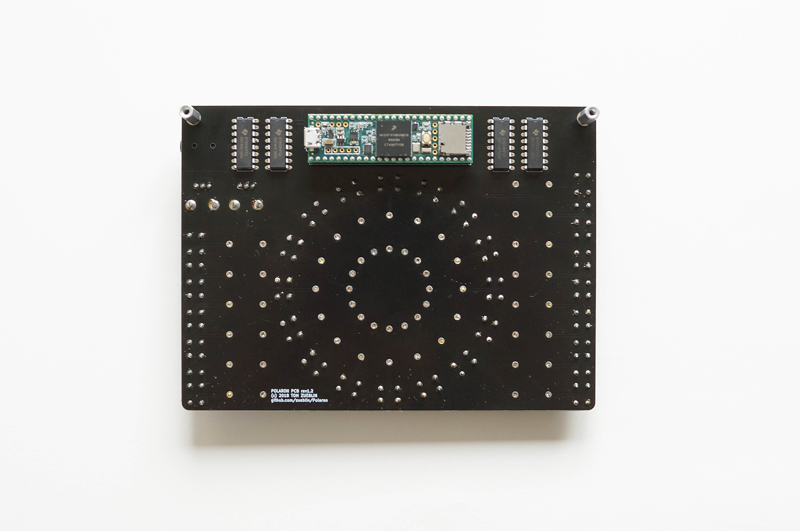
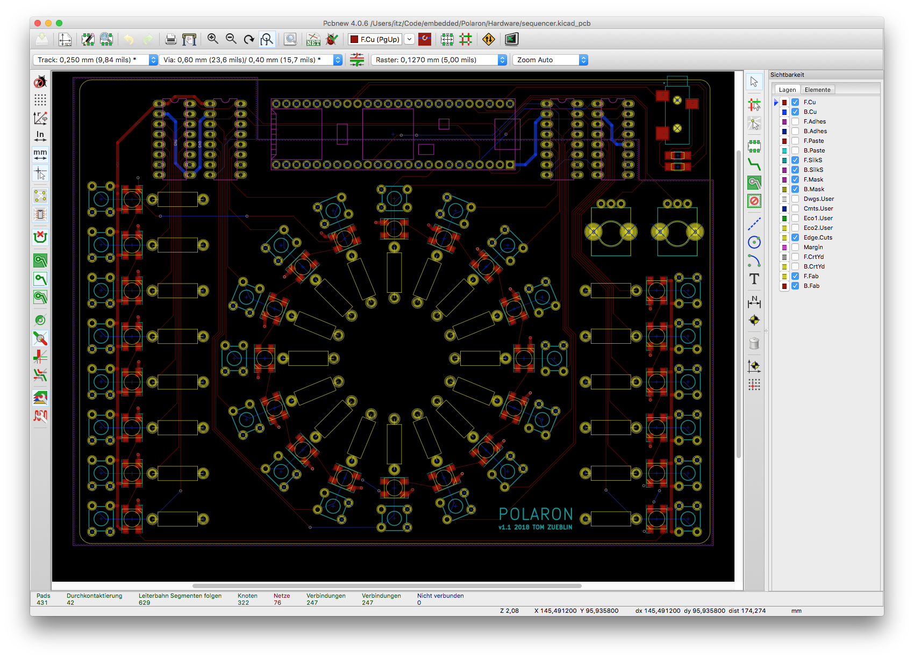

Polaron
=======

Polaron is a DIY digital drum machine based on the [Teensy 3.6](https://www.pjrc.com/teensy/) USB Microcontroller plattform.

Main features:
* 16 step sequencer
* 6 instrument tracks
* 2 pots for parameter control
* parameter locks: all instrument parameters can be recorded for each step
* different pattern length for each instrument track
* midi sync
* crunchy 12bit stereo outputs
* open source hardware/software: if you miss a feature or are annoyed by a bug

Software
--------

To build the software, the following tools are required:

* [Arduino IDE](https://www.arduino.cc/en/Main/Software) (tested with 1.8.6)
* [Teensyduino Add-On](https://www.pjrc.com/teensy/teensyduino.html) (tested with 1.43)

Hardware
--------

PCB is designed using KICAD 4.0.6

Parts needed:
* Teensy 3.6 32bit Microcontroller
* 30 x WS2812b RGB LEDs
* 30 x 6x6mm Pushbuttons
* 30 x 270 ohm Resistors
* 4 x SN74HC165N Shiftregister 
* 2 x ALPS Potentiometer (RK09K1130AP5)
* 2 x 2.2 uF SMD Capacitor (1206 housing)
* 1 x Audio Jack (SJ-352X-SMT) 

Disclaimer: This project is a work in progress. Features may not work, use at your own risk.

License
=======

Code: MIT

Hardware: cc-by-sa-3.0

By: Thomas Zueblin (thomas.zueblin@gmail.com)
